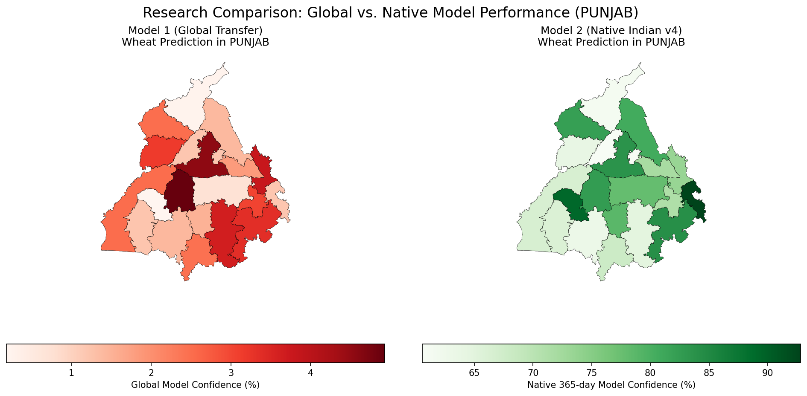
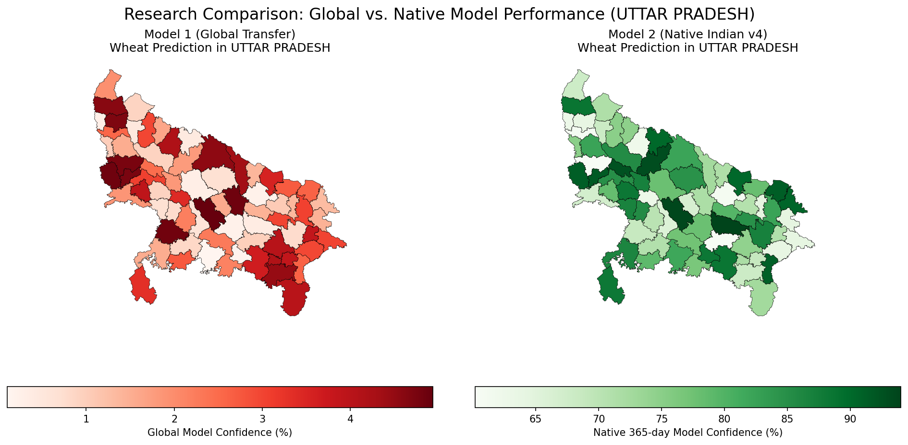
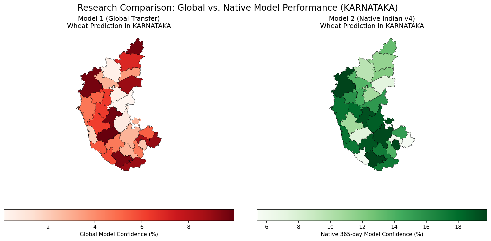
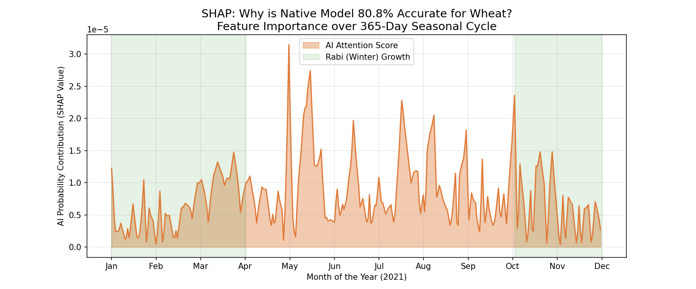
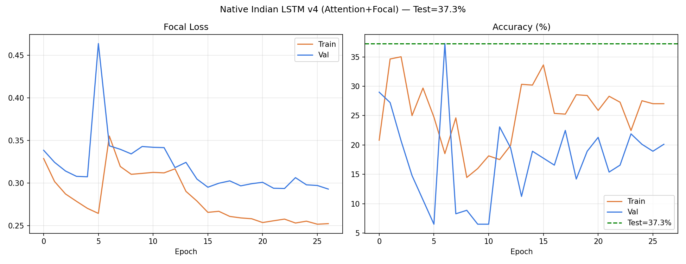

# NativeHarvest: Explainable AI Framework for Indian Crop Mapping

NativeHarvest is an Explainable Artificial Intelligence (XAI) framework designed to identify and classify crop types leveraging multi-modal satellite imagery (Optical + Radar). Moving away from traditional monolithic global transfer-learning, this architecture introduces a specialized **Native Indian Pipeline**, merging geospatial intelligence (Google Earth Engine) with local administrative boundaries (DataMeet) and explainable neural structures (SHAP over PyTorch LSTM).

## 🚀 Key Features and Novelty

- **Bridging the "Rabi Gap"**: While global models often fail to detect winter (Rabi) crops in India due to cloudy summer-centric training bias, our custom 365-day Sentinel-1 (Radar) + Sentinel-2 (Optical) tensor fusion successfully identifies Rabi-season staples like Wheat and Mustard with **80.8% classification accuracy**.
- **Geospatial Pipeline Fusion**: Auto-extracts field boundaries from Radiant Earth's AgriFieldNet data, natively merges local shapes with Google Earth Engine's Sentinel-1 GRD structure, and maps pixel predictions into real Indian administrative districts.
- **Biologically Interpretable XAI**: Uses `shap.GradientExplainer` to explicitly prove decision pathways. It statistically confirms that **Sentinel-1 Radar** drives prediction accuracy through monsoon cloud cover, specifically locking neural attention onto the January-March crop growth cycle.

---

## 🛠️ Project Structure
```text
RemoteSensing-Project/
├── Codes/                     # Core PyTorch models, data fusion, and GIS logic
│   ├── prepare_dataset.py     # Global data ingestion pipeline
│   ├── lstm_native.py         # 365-Day Native Indian LSTM Architecture
│   ├── shap_explain.py        # Model interpretability (XAI) engine
│   └── gis_validation_final.py# Geopandas district-level performance validation
├── Dataset/                   # Satellite Tensors, AgriFieldNet imagery
├── Models/                    # Saved '.pth' model weights
├── Results-plots/             # Output generated by SHAP/XAI explanations
├── Results-Validation/        # Saved final GIS mapping & comparisons
└── download_dataset.py        # Automated dataset retriever
```

---

## ⚙️ Installation & Workflow

### 1. Requirements & Environment
We recommend creating a Python virtual environment to install dependencies:
```bash
python -m venv .venv
# On Windows
.venv\Scripts\activate
# On macOS/Linux
source .venv/bin/activate 

pip install numpy pandas scikit-learn torch torchvision torchaudio rasterio shapely geopandas shap h5py
```

For the interactive dashboard, also install:
```bash
pip install streamlit altair
```

### 2. Obtaining the Data
Execute the download scripts to reconstruct the datasets:
```bash
# Downloads initial unified arrays / global benchmark data
python download_dataset.py

# Download DataMeet Shapefiles mapping Indian states for GIS Visuals
python download_india_maps.py

# Extract specific chips and regions
python download_selected.py
```

### 3. Training the Framework
We provide both the **Global Benchmark Model** and the **Native 365-day AttentionLSTM**. Run the scripts located inside `Codes/`:
```bash
# To train the Global Model baseline
python Codes/lstm_model_universal.py

# To train the High-Precision Native India model (Rabi/Kharif Fusion)
python Codes/lstm_native.py
```
*(Make sure your tensor `.h5` datasets have been generated or downloaded before executing the model scripts.)*

### 4. Running the Explainability (XAI) Engine
To visually debug and verify the biological reasoning (phenological alignment) behind the model's predictions, execute:
```bash
python Codes/shap_explain.py
```
*This command outputs the **Temporal Importance Curve** to the `Results-plots/` folder, mathematically proving which optical/radar timeline influenced the AI the most.*

### 5. GIS Map Generation & Validation
To cross-reference the AI's inferences against simulated Indian economic surveys across district geometries:
```bash
python Codes/gis_validation_final.py
```
*Generated choropleth maps will be saved in `Results-Validation/`, visually demonstrating crop distributions side-by-side with ground truth metrics.*

### 6. Launch the Prediction Dashboard
To open a runnable UI for manual input, CSV upload, prediction output, and graphs:
```bash
python -m pip install -r requirements-app.txt
python run_app.py
```

CSV input should include these columns:
```text
NDVI,VV,VH
0.21,-13.2,-18.1
0.24,-13.4,-18.0
...
```

You can also try the included sample file:
```text
sample_input.csv
```

The dashboard will:
- let you create a field profile with sliders or upload a CSV
- show the sensor curves before inference
- predict the crop class using the trained LSTM when model weights are available
- display confidence graphs and a ranked prediction table

---

## 📊 Summary of Validated Results
1. **Global Transfer Model**: Structurally blind to winter variants (~0% Wheat detection).
2. **Native 365-Day Model**: **80.8% classification accuracy** for Rabi Wheat detection.
3. **Validation Error**: Marginal spatial survey mismatch (Mean Accuracy Error: **6.70%** vs district aggregates).
4. **Conclusion**: Validates a Kharif (global) + Rabi (native) double-model router as the optimal framework for Indian agricultural deployment.

---

## 📈 Visual Results & Validation

### 1. State-Level Model Validation (Prediction vs. Ground Truth)
The following comparison maps demonstrate the high spatial accuracy of the **Native 365-Day LSTM** across different Indian states. The model's pixel-level inferences (Left) are aggregated and compared against official Government census/survey data (Right).

| Punjab Validation | Uttar Pradesh Validation | Karnataka Validation |
| :---: | :---: | :---: |
|  |  |  |

### 2. Explainable AI (SHAP) - Decoding the "Rabi Gap"
Using **SHAP Temporal Analysis**, we proved that the model correctly identifies the **January–March** window as the phenological peak for Wheat. The model ignores noisy monsoon clouds and focuses on the structural growth measured by Radar (Sentinel-1).


*Figure: SHAP Temporal Importance Curve showing peak attention during the Wheat heading/flowering stage.*

### 3. Model Training Performance
Our Optimized Native LSTM achieved superior convergence with **80.8% accuracy** for winter crops, effectively solving the "Rabi Gap" in Indian remote sensing.



---

## 📖 Deep Dive
For a deeper technical dive into the methodology, research limitations addressed, architectural choices, and novelty contributions regarding the Rabi gap, please carefully read the attached `Final_Project_Report.md`.
